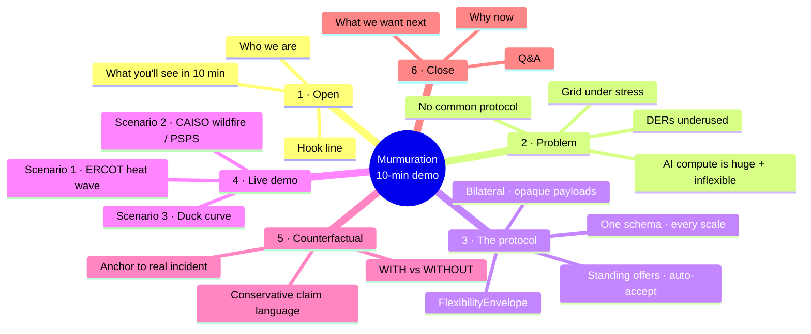

# Demo Flow — Murmuration

> First-stab mind map for the live pitch. Iterate freely. Treat each top-level node as a beat; sub-bullets are optional ammo.

## Visual map

---

## Beat 1 · Open  (~45s)

- **Hook line** (one sentence — punchy, not jargon)
  - candidate A: "The grid and the AI compute fleet need to start talking. We built the protocol."
  - candidate B: "Heat waves, wildfires, ramps — the grid keeps breaking. Meanwhile a million flexible loads sit idle. Here's why."
  - candidate C: _add your own_
- **Who we are** (5s — names + the SCSP track)
- **What you'll see**
  - One protocol
  - Three real-world scenarios
  - Numbers anchored to actual archived events

## Beat 2 · The problem  (~90s)

- **Climate volatility** is hitting peaks the grid wasn't sized for
- **AI compute** is the fastest-growing inflexible load in 50 years
  - LBNL 2024 DC report numbers (cite §A4)
- **DERs exist** at scale (VPPs, batteries, EVs, thermostats)
  - but they aggregate to almost nothing in real events
- **The gap**: no common protocol. Every dispatch is bespoke, manual, slow.
- _Land on:_ "Today's response is peakers, curtailment, blackouts. We can do better."

## Beat 3 · The protocol  (~75s)

- **FlexibilityEnvelope** = standing offer ("I can shed X MW for Y min at $Z/MWh, no per-event approval")
- **Two agents** negotiate on a shared bus
  - Grid-side agent (ISO operator persona)
  - Compute-side agent (hyperscaler ops persona)
- **Auto-accept within band** = no LLM round-trip on the dispatch path → response in <30s, not minutes
- **One schema, every scale**: 200 MW DC ↔ 5 kW home battery without modification

> Visual cue: bring up the bilateral-bus sequence diagram (`docs/murmuration_diagram.md` §5)

## Beat 4 · Live demo  (~4 min total · 70-80s per scenario)

### 4a · ERCOT heat wave  (NEED → SOURCE → ROUTE → PROTECT)
- _Click trigger_
- Talking points per phase:
  - **Need**: "HOU_HUB LMP just spiked $32 → $410. Real ERCOT archive, [date]."
  - **Source**: "Compute fleet auto-accepts. 850 MW of training migrates to CA-North in 12s."
  - **Route**: "VPP swarm — 47K homes — commits 320 MW. Same protocol, six orders of magnitude smaller."
  - **Protect**: "Hospitals never lost frequency. Settlement: $X."

### 4b · CAISO wildfire / PSPS
- Talking points: "Now California. Same protocol — different physics."
  - Bay Area DC routes work to ERCOT + PJM
  - Local CA VPP holds critical load through PSPS window

### 4c · Duck curve  (the optimistic one)
- "Not every event is a disaster. Sometimes there's too much clean energy."
- Negative LMP → compute leans IN (gets paid to absorb)
- 6pm sunset → flips to release + VPP shaves the ramp
- _Land on:_ "The duck curve becomes negotiable."

## Beat 5 · Counterfactual reveal  (~75s)

- Toggle "WITHOUT MURMURATION" view
- Anchor scenario to its real-world incident:
  - ERCOT heat → Uri Feb 2021 (246 deaths, $130B)
  - PSPS → PG&E Oct 2019 (800K customers)
  - Duck curve → CAISO 2024 (~800 GWh curtailed)
- **Claim language hygiene**: "would have softened" / "would have prevented X% of" — never absolutes
- _Honest concession:_ "We don't claim to prevent these. We claim a measurable supplement."

## Beat 6 · Close + CTA  (~45s)

- **Why now**: protocol design + standing-envelope pattern works because LLMs can read intent and stay out of the dispatch path
- **What we want**: pilot partners — one ISO + one hyperscaler campus + one VPP aggregator
- **Hand off to Q&A**

---

## Q&A prep

- "How is this different from existing demand response?"
  - DR = manual, slow, contractual. Envelopes = standing, telemetric, settled per-event.
- "Why should an ISO trust an LLM in the loop?"
  - LLM is OUT of the dispatch path. It writes the standing envelope. Dispatch is deterministic.
- "What's your data source?"
  - gridstatus archive (CAISO/ERCOT/PJM), EIA-930, NREL PVWatts, CAISO OASIS. Cited in `docs/calibration.md`.
- "What about cybersecurity?"
  - Bilateral channel, opaque payloads, signed envelopes. Same trust model as ISO ↔ market participant today.

---

## Logistics & contingencies

- **Wifi assumption**: none. Demo is offline-safe (cached JSON in `public/cache/`).
- **Backup**: pre-recorded video of full demo at `docs/demo/backup_video.mp4` (TODO).
- **Failure mode**: if globe fails to load, fall back to scenario menu in side-panel.
- **Time check**: aim 8 min for content, 2 min Q&A buffer in a 10-min slot.
- **What to NOT click**: counterfactual toggle until Beat 5 (avoid spoiling the climax).

---

## Open questions / decisions to lock before stage

- [ ] Which hook line? (A / B / C / new)
- [ ] Demo on live data, cache-only, or hybrid?
- [ ] Counterfactual toggle on by default during pitch?
- [ ] Order of scenarios: ERCOT first (most dramatic) or duck curve first (most surprising)?
- [ ] Who drives the keyboard, who narrates?
