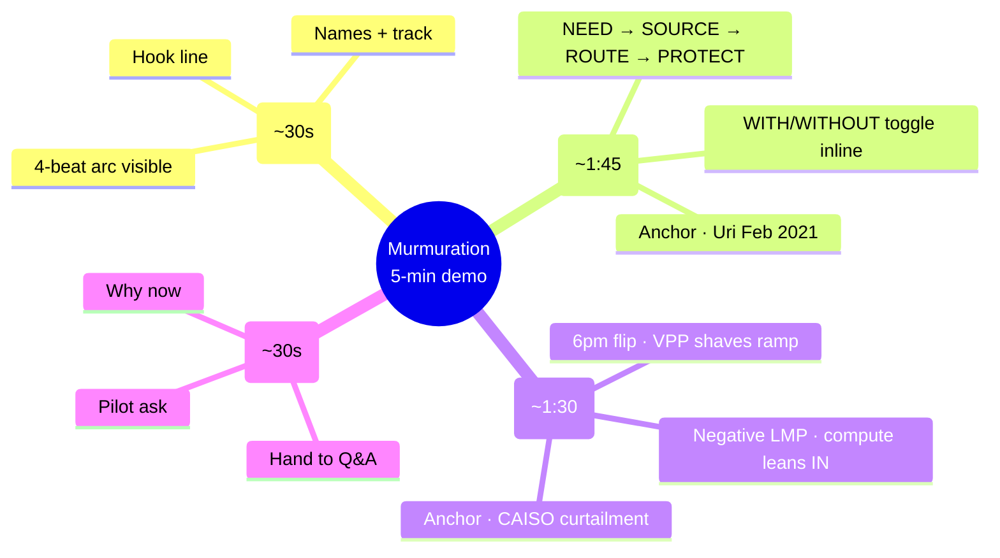

# Demo Flow — Murmuration  (5-min budget)

> Live pitch script for the SCSP Hackathon Grid track. Judges: Monty McGee (operational realism) + Dr. Masoud Barati (model correctness). Rubric mapping in `criteria.md`. Hard-question defenses in `judge_qa_prep.md`.
>
> **Hard rule:** SCSP submission is "kept under 5 minutes of demo time." Q&A is *separate* and after — don't blow the 5 min trying to pre-empt questions.
>
> **Claim hygiene:** "would have softened," "would have prevented X% of," "measurable supplement." Never absolutes. Uri killed 246 people; we owe the language.

## Visual map

## Time budget (strict)

| Beat | Target | Hard cap |
|---|---|---|
| 1 · Cold open slide | 0:30 | 0:40 |
| 2 · ERCOT heat wave | 1:45 | 2:00 |
| 3 · Duck curve | 1:30 | 1:45 |
| 4 · Live close | 0:30 | 0:40 |
| **Total** | **4:15** | **5:00** |

45-second buffer is intentional. Demos drift. If you're at 3:30 entering Beat 4, cut the close to 30s flat and stop talking.

---

## Beat 1 · Cold open slide  (~30s)

Single slide. See `demo_slides.html` (or `demo_slides.md`).

- **Hook line** (lock one before stage):
  - A: "The grid and the AI compute fleet need to start talking. We built the protocol."
  - B: "Heat waves, wildfires, ramps — the grid keeps breaking. Meanwhile a million flexible loads sit idle."
- **Names + SCSP Grid track**  (5s — fast)
- **What you'll see**: "Two real-world scenarios, one protocol, anchored to actual archived events."

> Then — and this is the most important transition in the demo — close the slide and switch to the live app. Don't linger on the slide. The rest is shown, not told.

## Beat 2 · ERCOT heat wave  (~1:45)

The dramatic one. Anchored to Feb 2021 Uri (246 deaths, $130B). McGee's "control room" beat.

### Phase walk (NEED → SOURCE → ROUTE → PROTECT)

- **Need** (~25s): "HOU_HUB LMP just spiked $32 → $410. Real ERCOT archive, [date]. Operator screen shows headroom collapsing. Grid agent emits a `DispatchRequest` on the bilateral bus."
  - *McGee hook:* this is what an operator sees. *Barati hook:* clean cause→effect — demand spike → price signal → bus message.
- **Source** (~25s): "Compute fleet's standing envelope is already on file — 850 MW shed-able for up to 4 hours at $X/MWh. Auto-accept within band. Migration starts in 12 seconds."
  - *Pre-empt the LLM question:* "Notice no LLM round-trip on this path. The envelope was written offline. Dispatch is deterministic by design — that's why it lands in seconds, not minutes."
- **Route** (~20s): "Same protocol, six orders of magnitude smaller. VPP swarm, 47K homes, commits 320 MW. One wire format from data center to home battery."
- **Protect** (~15s): "Frequency held. Hospitals never browned out. Settlement: peakers stayed cold."

### WITH / WITHOUT toggle  (~20s, integrated)

Toggle the counterfactual *inside this scenario*, not at the end of the deck. McGee + Barati both want the delta visible.

| | WITHOUT Murmuration | WITH Murmuration |
|---|---|---|
| Peaker MWh fired | ~Y MWh | 0 |
| Customers exposed to brown-out risk | tens of thousands | 0 |
| Frequency excursions | one event | 0 |
| Settlement | scarcity prices | envelope rate |

> Speaker line on toggle: "Honest framing — we don't claim Murmuration would have prevented Uri. We claim it would have softened it. The 1.4M customers who lost power for days were the consequence of zero coordination. This is coordination."

## Beat 3 · Duck curve  (~1:30)

The optimistic one. Bidirectional system dynamics. Barati's "feedback loops" beat. Less drama, more correctness.

- **Setup** (~15s): "Not every grid event is a disaster. Sometimes there's too much clean energy. CAISO duck curve, April 15 2024. LMP at SP-15 went *negative* — -$51.56/MWh — between 11am and 2pm."
- **Compute leans IN** (~25s): "Compute fleet's envelope says 'I'll absorb up to 600 MW at clearing price ≤ -$10.' It gets paid to soak up solar. Carbon factor at midday: ~50 g/kWh. Effectively free, low-carbon training compute."
  - *Barati hook:* this shows the protocol is bidirectional — the same envelope goes the other way.
- **Sunset flip** (~25s): "6pm. Sun drops. Net load ramps from 18 GW to 30 GW in three hours. The classic ramp. Compute fleet flips: releases the load it absorbed earlier, VPP swarm shaves the ramp peak."
- **WITH / WITHOUT toggle** (~25s, integrated):

| | WITHOUT | WITH |
|---|---|---|
| Curtailed renewables | ~Z MWh | reduced |
| Evening ramp peak | spike | smoothed |
| Carbon, midday compute | ~430 g/kWh (gas) | ~50 g/kWh (solar) |
| Operator headroom | tight | restored |

> Speaker line: "The duck curve becomes negotiable. Same protocol, opposite direction. CAISO curtailed roughly 800 GWh of renewables last year. Even shaving a fraction of that is real money and real carbon."

## Beat 4 · Live close  (~30s)

Stay in the live app. No second slide.

- **Why now** (~10s): "LLMs can read operator intent and write standing envelopes — and stay out of the dispatch path. That's the unlock."
- **Ask** (~10s): "We want a pilot. One ISO, one hyperscaler campus, one VPP aggregator. 12 months. No new market rules required."
- **Hand off** (~10s): "Happy to take questions. PSPS scenario, the LLM envelope writer, threat model — all in the doc, ready to dive in."

---

## What we deliberately cut

- **PSPS / wildfire scenario.** Strong, but two scenarios is the right number for 5 min and ERCOT + duck cover both stress and steady-state. PSPS is the strongest Q&A ammo if asked "what about wildfire?".
- **Beat 5 standalone counterfactual.** Folded into each scenario's WITH/WITHOUT toggle — earns the same impact in less time.
- **Slide 2 (problem framing) and Slide 3 (arc).** Speaker delivers verbally during the Beat 1 transition. Saves ~45s.

If we recover time on stage and want a third scenario, queue PSPS — but only if Beat 3 finishes by 3:00.

---

## Q&A prep

Q&A is its own document — see `judge_qa_prep.md`. The hard questions and judge-specific framing live there.

Quick lookup:
- "Where's the AI?" → `judge_qa_prep.md` "The killer question"
- "How is this different from DR?" → `judge_qa_prep.md` "why is this hard?"
- "Threat model?" → `judge_qa_prep.md` "threat-model questions"
- "What can the demo NOT do?" → `judge_qa_prep.md` "honest-limit questions"

---

## Logistics & contingencies

- **Wifi assumption**: none. Demo is offline-safe (cached JSON in `public/cache/`).
- **Backup**: pre-recorded video at `docs/demo/backup_video.mp4` (TODO).
- **Failure mode**: if globe fails to load, fall back to scenario menu in side-panel.
- **Time check**: glance at the clock at the end of Beat 2. If past 2:30, trim Beat 3 setup.
- **What to NOT click**: nothing — counterfactual is now per-scenario, not a separate reveal.

---

## Open questions / decisions to lock before stage

- [ ] Hook line A or B?
- [ ] Live data, cache-only, or hybrid?
- [ ] Who drives the keyboard, who narrates? (Note: only need 1 person on-site per SCSP rules.)
- [ ] Final slide deck on this laptop or co-hacker's? Whose UI dashboard wins which beat?
- [ ] Backup video recorded?
