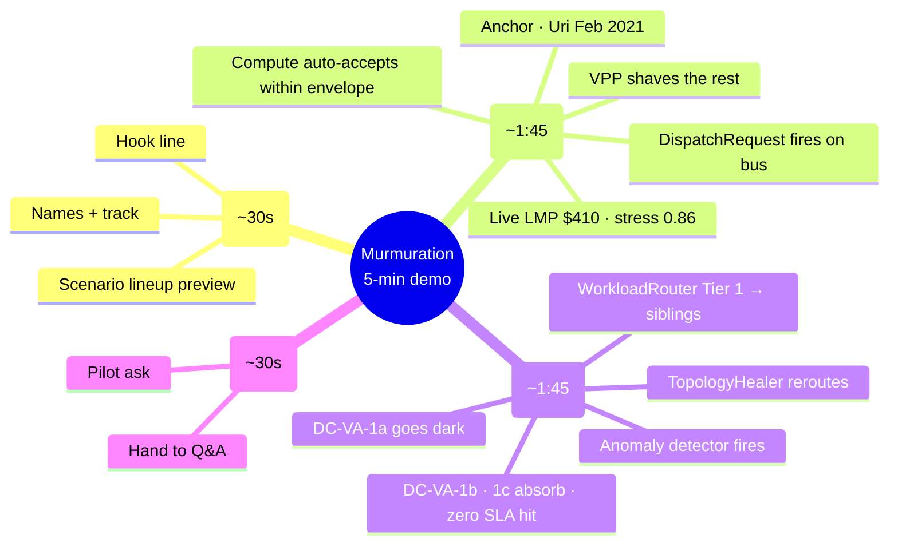

# Demo Flow — Murmuration  (5-min budget)

> Live pitch script for the SCSP Hackathon Grid track. Judges: Monty McGee (operational realism) + Dr. Masoud Barati (model correctness). Rubric mapping in `criteria.md`. Hard-question defenses in `judge_qa_prep.md`.
>
> **Hard rule:** SCSP submission is "kept under 5 minutes of demo time." Q&A is *separate* and after — don't blow the 5 min trying to pre-empt questions.
>
> **Claim hygiene:** "would have softened," "would have prevented X% of," "measurable supplement." Never absolutes. Uri killed 246 people; we owe the language.
>
> **Built against the dev-cs codebase**: Python backend at `http://127.0.0.1:8765`, live tick loop (3s), 9 scenarios in `simulator/scenarios.py`, 3 UI views (Globe / Flat Map / Story).

## Visual map



## Time budget (strict)

| Beat | Target | Hard cap |
|---|---|---|
| 1 · Cold open slide | 0:30 | 0:40 |
| 2 · Texas heat wave | 1:45 | 2:00 |
| 3 · PJM Loudoun self-healing | 1:45 | 2:00 |
| 4 · Live close | 0:30 | 0:40 |
| **Total** | **4:30** | **5:00** |

30-second buffer is intentional. Demos drift. If you're at 4:00 entering Beat 4, cut the close to 30s flat and stop talking.

---

## Beat 1 · Cold open slide  (~30s)

Single slide. See `demo_slides.html` (or `demo_slides.md`).

- **Hook line** (lock one before stage):
  - A: "The grid and the AI compute fleet need to start talking. We built the protocol — and the agents that speak it."
  - B: "Heat waves, line trips, ramps — the grid keeps breaking. Meanwhile a million flexible loads sit idle. We built the wire format that lets them coordinate."
- **Names + SCSP Grid track**  (5s — fast)
- **What you'll see**: "Two real-world scenarios, one protocol, two real Python agents on a bilateral bus, anchored to actual archived events."

> Then — and this is the most important transition in the demo — close the slide and switch to the live app. Don't linger on the slide. The rest is shown, not told.

## Beat 2 · Texas heat wave  (~1:45)

The dramatic one. Anchored to Feb 2021 Uri (246 deaths, $130B). McGee's "control room" beat.

**Setup before the beat:** make sure the **3D Globe view** is selected (top-center tabs). Camera should be focused on continental US. Click the "Texas heat wave" scenario in the side panel.

### Live narration (~25s)
- "HOU_HUB LMP just spiked to $410. That number is a real ERCOT scenario override fed into the live tick loop."
- Point at the **bus feed** on the right rail — `GridStateUpdate` ticking, then a `DispatchRequest` appears.
- *McGee hook:* this is what an operator sees. *Barati hook:* clean cause→effect — demand spike → price signal → bus message.

### Compute side responds (~30s)
- "The compute fleet's standing `FlexibilityEnvelope` is already on file — it was published last tick by `ComputeAgent`. Auto-accept within band."
- Watch the bus: `DispatchAck` lands within ~2 seconds, then `TelemetryFrame` starts streaming.
- Globe: an arc fires from ERCOT to a sibling region (cross-region migration via `WorkloadMigration`).
- *Pre-empt the LLM question:* "The dispatch path is deterministic by design — that's why it lands in seconds, not minutes. Where's the LLM? It writes the *envelope* offline (the operator's standing offer). And it narrates this scenario live in the agent-chatter feed below."

### VPP swarm engages (~30s)
- The grid agent fans out a smaller dispatch to the Bay Area VPP (`make_bay_area_vpp` — 100 homes, ~5 kW each).
- "Same `FlexibilityEnvelope` schema, six orders of magnitude smaller. One wire format from data center to home battery. The protocol scales."
- VPP cluster on the globe brightens; a smaller arc fans from the VPP centroid to the stressed BA.

### Counterfactual (~20s, spoken)
- "Honest framing: we don't claim Murmuration would have prevented Uri. We claim it would have softened it. The 4.5 million customers who lost power for days were the consequence of zero coordination across the bilateral interface. This is the coordination."
- Point at the metrics tracker showing MW-min relief, $ paid, tCO₂ avoided.

## Beat 3 · PJM Loudoun substation overload  (~1:45)

The technical-depth one. Self-healing grid. Barati's "feedback loops" beat AND McGee's "control room" beat at the same time. **This is the standout dev-cs differentiator that nictopia couldn't show — don't skip it.**

**Setup:** Reset the previous scenario (let it expire or click reset). Click "PJM Loudoun substation overload" in the side panel.

### Outage triggers (~25s)
- "Loudoun substation supplying our Northern Virginia data center DC-VA-1a just saturated. The AZ goes dark."
- Watch the globe: DC-VA-1a marker dims to gray (unavailable). The **anomaly detector** auto-fires `ContingencyAlert` (purple flash on the globe).
- *Barati hook:* "The detector is a rolling z-score on the live `GridStateUpdate` stream — 4σ threshold. No scripting, no scenario said 'fire an alert' — the math fired it."

### Topology healer responds (~25s)
- The `TopologyHealer` consumes the alert, marks the affected edge failed in the `networkx` substation graph, computes K-shortest alternate paths, publishes `TopologyReconfigure` on the bus.
- Watch the bus feed for the healer's message — green flag "Self-healing · TX-EDGE-12 rerouted."
- *McGee hook:* "An ISO operator sees this exact pattern in their EMS today. We're showing the protocol layer that lets the compute side react to it without phone-tree coordination."

### Workload router escalates by tier (~30s)
- The `ComputeAgent`'s `WorkloadRouter` activates. Tier 1: route stranded workloads from DC-VA-1a to **sibling AZs** DC-VA-1b (Sterling) and DC-VA-1c (Manassas). Sub-millisecond latency. No data migration.
- Watch the globe: short cyan arcs flash *within* the NoVA cluster — sibling-AZ failover.
- "Notice: no cross-region migration fired. The router's Tier 1 logic kept the workload local because the sibling AZs had headroom. That's exactly what an actual cloud scheduler does — pick the cheapest tier that satisfies the constraint."

### The pitch (~25s)
- "Three things just happened automatically. The anomaly detector caught an unplanned event. The topology healer rerouted around it. The workload router picked the cheapest fix. No human in the loop on any of those — and **none of it was scripted into this scenario**. The scenario only said 'mark DC-VA-1a unavailable.' The protocol did the rest."
- *Both judges:* this is the cleanest demonstration of "behaves like a valid simplified power system."

## Beat 4 · Live close  (~30s)

Stay in the live app. Either keep on Globe view, or switch to the **Story tab** for a slide-style close.

- **Why now** (~10s): "LLMs can read operator intent and write standing envelopes — and stay out of the dispatch path. Live agents on each side, narrating in plain English. That's the unlock."
- **Ask** (~10s): "We want a pilot. One ISO, one hyperscaler campus, one VPP aggregator. 12 months. No new market rules required."
- **Hand off** (~10s): "Happy to take questions. The seven other scenarios — surplus solar, polar vortex cascade, line-trip contingency, carbon arbitrage, eclipse — are all loaded and ready if you want to see them."

---

## What we deliberately cut

- **CAISO surplus solar / duck curve as a stage scenario.** Strong, but two scenarios is the right number for 5 min and Texas heat wave + PJM Loudoun cover both stress and self-healing. Surplus solar is the strongest Q&A ammo if asked "what about renewables?" — queue it as the optional 3rd scenario if Beat 3 finishes by 3:30.
- **Polar vortex cascade.** Multi-BA cascade is impressive but harder to narrate in <2 min.
- **Carbon arbitrage scenario.** The economic argument is real but lands flat on stage — keep it for written follow-up.
- **Slide 2 (problem framing) and Slide 3 (arc).** Speaker delivers verbally during the Beat 1 transition. Saves ~45s.

If we recover time on stage and want a third scenario, queue CAISO surplus solar — but only if Beat 3 finishes by 3:30.

---

## Q&A prep

Q&A is its own document — see `judge_qa_prep.md`. The hard questions and judge-specific framing live there.

Quick lookup:
- "Where's the AI?" → `judge_qa_prep.md` "The killer question" (much stronger answer with dev-cs's live narrator)
- "How is this different from DR?" → `judge_qa_prep.md` "why is this hard?"
- "Threat model?" → `judge_qa_prep.md` "threat-model questions"
- "What can the demo NOT do?" → `judge_qa_prep.md` "honest-limit questions"
- "Tell me about the self-healing" → `judge_qa_prep.md` "topology healer + anomaly detector"

---

## Logistics & contingencies

- **Wifi assumption**: minimal. Demo runs on the local Python backend; live ISO data needs network but falls back to plausible synthetics on failure (`iso_client.py` has graceful degradation).
- **Run command**: `bash murmuration/run.sh` from the repo root — needs `.venv` activated with `requirements.txt` installed.
- **URL**: `http://127.0.0.1:8765` (NOT 5173 — that was nictopia/Vite).
- **Backup**: pre-recorded video at `docs/demo/backup_video.mp4` (TODO — record once dev-na is stable).
- **Failure mode**: if globe fails to load (WebGL issue on demo machine), switch to **Flat Map** tab — same data, simpler renderer.
- **Failure mode 2**: if live ISO data times out, the simulator continues with cached snapshots; demo is uninterrupted.
- **Time check**: glance at the session clock (top header) at the end of Beat 2. If past 2:30, trim Beat 3 setup.
- **What to NOT click**: scenario buttons during a different scenario's playback. Wait for the previous to expire (or click reset).

---

## Open questions / decisions to lock before stage

- [ ] Hook line A or B?
- [ ] Live ISO data on stage, or pre-warmed cache only? (Recommend cache-only — fewer moving parts.)
- [ ] Who drives the keyboard, who narrates? (Note: only need 1 person on-site per SCSP rules.)
- [ ] **Is the live Anthropic narrator enabled?** Set `ANTHROPIC_API_KEY` in `.env`. If not set, dev-cs falls back to rule-based narration. Live LLM is more impressive; rule-based is more reliable. Lock this before stage.
- [ ] **NREL_API_KEY for solar profiles?** Optional — only enriches forecasts. Worth setting.
- [ ] **EIA_KEY for ERCOT/PJM/MISO/etc.?** CAISO works without it; others use synthetic without it. Worth setting.
- [ ] Backup video recorded?

---

## Setup checklist (do before doors open)

```bash
# 1. Backend running
cd /path/to/murmuration
bash murmuration/run.sh    # backgrounded, leave it running

# 2. Browser open at http://127.0.0.1:8765
# 3. 3D Globe tab selected
# 4. Scenario list visible in side panel
# 5. Bus feed scrolling (proves the tick loop is alive)
# 6. Audio off (no surprise notifications during pitch)
# 7. Display mirroring set up (if projecting)
# 8. Backup video file open in another tab
```

If any of those 8 isn't ready 5 minutes before stage, abort and run from the backup video.
