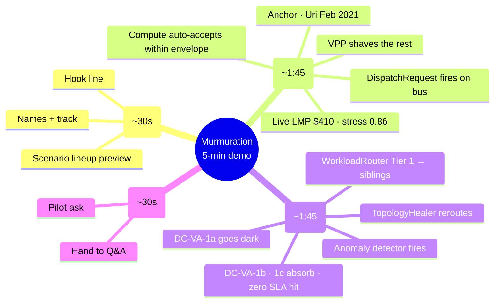

# Demo Flow — Murmuration  (5-min budget)

> Live pitch script for the SCSP Hackathon Grid track. Judges: Monty McGee (operational realism) + Dr. Masoud Barati (model correctness). Rubric mapping in `criteria.md`. Hard-question defenses in `judge_qa_prep.md`.
>
> **Hard rule:** SCSP submission is "kept under 5 minutes of demo time." Q&A is *separate* and after — don't blow the 5 min trying to pre-empt questions.
>
> **Claim hygiene:** "would have softened," "would have prevented X% of," "measurable supplement." Never absolutes. Uri killed 246 people; we owe the language.
>
> **Built against the dev-cs codebase**: Python backend at `http://127.0.0.1:8765`, live tick loop (3s), 9 scenarios in `simulator/scenarios.py`, 3 UI views (Globe / Flat Map / Story).

## Visual map



## Time budget (strict)

| Beat | Target | Hard cap |
|---|---|---|
| 1 · Cold open slide (problem paint + hook + arc) | 0:45 | 0:55 |
| 2 · Texas heat wave | 1:30 | 1:45 |
| 3 · PJM Loudoun self-healing | 1:30 | 1:45 |
| 4 · Live close (future paint + ask) | 0:40 | 0:50 |
| **Total** | **4:25** | **5:00** |

35-second buffer is intentional. Demos drift. If you're at 4:00 entering Beat 4, cut the close to 30s flat — keep the future-paint sentence and the pilot ask, drop the unlocks line. Stop talking by 5:00 no matter what.

---

## Beat 1 · Cold open slide  (~45s)

Single slide. See `demo_slides.html` (or `demo_slides.md`).

The job of this beat is to **earn the hook before swinging it**. Don't open with the solution — open with the problem the experts in the audience already know in their bones, then deliver the hook as the inflection.

### Problem paint (~15s — paint, don't lecture)

Three angles, ~5s each. Don't read them; deliver them.

1. "The grid is breaking more often, with higher stakes. Heat waves, polar vortexes, line trips, **Asheville floods, Maui fires, California wildfires** — events we used to call rare now hit every season." **[brief pause]** "I've probably missed ones that hit closer to home for some of you." *(The pause + acknowledgment is doing real work — every grid person in the room has lived through one of these. Don't rush past it.)*
2. "The experts who keep it standing — grid operators, utilities, regulators shaping the rules — are doing it with coordination tools designed for a world that doesn't exist anymore."
3. "And on the other side: data centers scaling at gigawatt pace, EV fleets, home batteries — billions of dollars of flexibility sitting idle when stress hits, because **there's no common language between supply and demand.**"

### Hook (~10s — locked: A. Re-confirm at 2pm sync.)

> "The grid and the AI compute fleet need to start talking. We built the protocol — and the agents that speak it."

### Names + arc (~15s)

- "I'm \_\_\_\_\_, Murmuration, SCSP Grid track."
- "What you'll see: two real-world scenarios, one protocol, two real Python agents on a bilateral bus, **anchored to actual archived events.** Then we'll show what it looks like when the grid heals itself with no human in the loop."

> Then — most important transition in the demo — close the slide and switch to the live app. Don't linger. The rest is shown, not told.

## Beat 2 · Texas heat wave  (~1:45)

The dramatic one. Anchored to Feb 2021 Uri (246 deaths, $130B). McGee's "control room" beat.

**Setup before the beat:** make sure the **3D Globe view** is selected (top-center tabs). Camera should be focused on continental US. Click the "Texas heat wave" scenario in the side panel.

### Live narration (~25s)
- "Houston's wholesale electricity price — the **Locational Marginal Price**, or **LMP** — just spiked to $410. That number is a real scenario override from the **Electric Reliability Council of Texas** — **ERCOT** — fed into the live tick loop." *(After first use, "LMP" and "ERCOT" can be used freely. Define on first use only.)*
- Point at the **bus feed** on the right rail — `GridStateUpdate` ticking, then a `DispatchRequest` appears.
- *McGee hook:* this is what an operator sees. *Barati hook:* clean cause→effect — demand spike → price signal → bus message.

### Compute side responds (~30s)
- "The compute fleet's standing `FlexibilityEnvelope` — its published offer: *'I'll absorb up to X megawatts, in this price band, with this notice'* — is already on file. It was published last tick by `ComputeAgent`. Auto-accept within band." *(The inline definition is for non-DR-fluent judges. Skip the parenthetical if you're confident the judge knows the term — saves ~4s.)*
- Watch the bus: `DispatchAck` lands within ~2 seconds, then `TelemetryFrame` starts streaming.
- Globe: an arc fires from ERCOT to a sibling region (cross-region migration via `WorkloadMigration`).
- *Pre-empt the LLM question:* "The dispatch path is deterministic by design — that's why it lands in seconds, not minutes. Where's the LLM? It writes the *envelope* offline (the operator's standing offer). And it narrates this scenario live in the agent-chatter feed below."

### VPP swarm engages (~30s)
- The grid agent fans out a smaller dispatch to the Bay Area VPP (`make_bay_area_vpp` — 100 homes, ~5 kW each).
- VPP cluster on the globe brightens; a smaller arc fans from the VPP centroid to the stressed BA.
- "This is a **Virtual Power Plant** — or **VPP**: a swarm of home batteries, EVs, and smart thermostats acting as one dispatchable resource."
- "Same `FlexibilityEnvelope` schema as the data center, **six orders of magnitude smaller**. One wire format from gigawatt to kilowatt."
- "And this is where **everyday households become first-class grid participants** — earning revenue when their batteries help during stress events. The reserves of the future aren't just peaker plants — they're neighborhoods." *(This is the populist + opportunity beat. SCSP-aligned: democratic participation in critical infrastructure. Don't skip.)*

### Counterfactual (~20s, spoken)
- "Honest framing: we don't claim Murmuration would have prevented Uri. We claim it would have softened it. The 4.5 million customers who lost power for days were the consequence of zero coordination across the bilateral interface. This is the coordination."
- Point at the metrics tracker showing MW-min relief, $ paid, tCO₂ avoided.

## Beat 3 · PJM Loudoun substation overload  (~1:45)

The technical-depth one. Self-healing grid. Barati's "feedback loops" beat AND McGee's "control room" beat at the same time. **This is the standout dev-cs differentiator that nictopia couldn't show — don't skip it.**

**Setup:** Reset the previous scenario (let it expire or click reset). Click "PJM Loudoun substation overload" in the side panel.

### Outage triggers (~25s)
- "Loudoun substation in the **PJM Interconnection** — the mid-Atlantic grid operator — supplying our Northern Virginia data center DC-VA-1a just saturated. The **availability zone** goes dark." *(First use of PJM and availability zone — after this, "PJM" and "AZ" are fair game without re-defining.)*
- Watch the globe: DC-VA-1a marker dims to gray (unavailable). The **anomaly detector** auto-fires `ContingencyAlert` (purple flash on the globe).
- *Barati hook:* "The detector is a rolling z-score on the live `GridStateUpdate` stream — 4σ threshold. No scripting, no scenario said 'fire an alert' — the math fired it."

### Topology healer responds (~25s)
- The `TopologyHealer` consumes the alert, marks the affected edge failed in the `networkx` substation graph, computes K-shortest alternate paths, publishes `TopologyReconfigure` on the bus.
- Watch the bus feed for the healer's message — green flag "Self-healing · TX-EDGE-12 rerouted."
- *McGee hook:* "Operators at an **Independent System Operator** — an **ISO** — see this exact pattern in their **Energy Management System** (EMS) today. We're showing the protocol layer that lets the compute side react to it without phone-tree coordination."

### Workload router escalates by tier (~30s)
- The `ComputeAgent`'s `WorkloadRouter` activates. Tier 1: route stranded workloads from DC-VA-1a to **sibling AZs** DC-VA-1b (Sterling) and DC-VA-1c (Manassas). Sub-millisecond latency. No data migration.
- Watch the globe: short cyan arcs flash *within* the NoVA cluster — sibling-AZ failover.
- "Notice: no cross-region migration fired. The router's Tier 1 logic kept the workload local because the sibling AZs had headroom. That's exactly what an actual cloud scheduler does — pick the cheapest tier that satisfies the constraint."

### The pitch (~25s)
- "Three things just happened automatically. The anomaly detector caught an unplanned event. The topology healer rerouted around it. The workload router picked the cheapest fix. No human in the loop on any of those — and **none of it was scripted into this scenario**. The scenario only said 'mark DC-VA-1a unavailable.' The protocol did the rest."
- *Both judges:* this is the cleanest demonstration of "behaves like a valid simplified power system."

## Beat 4 · Live close  (~40s)

Stay in the live app. Either keep on Globe view, or switch to the **Story tab** for a slide-style close.

The job of this beat is to **paint the future** — not as utopia, but as a coordination layer that augments the experts already doing the work. Land hard on "enablement, not replacement." This is the framing every grid-skeptical judge needs to hear.

### Future paint — enablement layer for the experts (~15s)

"The role for AI here isn't replacing operators, utilities, or policymakers. It's giving the experts who keep the lights on a **faster way to coordinate** — with the compute fleet, with VPP aggregators, with the regulators shaping the rules. We're the enablement layer. **Experts keep the wheel. We make it turn faster.**"

### What this unlocks (~15s)

"Data centers keep scaling — without breaking the grid. **Critical infrastructure** — hospitals, water systems, ISO control rooms — gets first-class routing the moment stress hits. And as you just saw, **everyday households** — through virtual power plants — become dispatchable reserves and earn revenue when they help. None of it requires new market rules."

*Three pillars: data centers, critical infra, consumers. Rhetorical pattern of three lands. Don't add a fourth.*

### Ask + hand off (~15s)

- **Ask:** "We want a pilot: one ISO, one **hyperscaler** (large cloud provider) campus, one VPP aggregator. 12 months."
- **Hand off:** "Happy to take questions. Seven other scenarios are loaded — surplus solar, polar vortex, line-trip contingency, carbon arbitrage, eclipse — different shapes of the same problem, same protocol solving them."

---

## What we deliberately cut

- **CAISO surplus solar / duck curve as a stage scenario.** Strong, but two scenarios is the right number for 5 min and Texas heat wave + PJM Loudoun cover both stress and self-healing. Surplus solar is the strongest Q&A ammo if asked "what about renewables?" — queue it as the optional 3rd scenario if Beat 3 finishes by 3:30.
- **Polar vortex cascade.** Multi-BA cascade is impressive but harder to narrate in <2 min.
- **Carbon arbitrage scenario.** The economic argument is real but lands flat on stage — keep it for written follow-up.
- **Slide 2 (problem framing) and Slide 3 (arc).** Speaker delivers verbally during the Beat 1 transition. Saves ~45s.

If we recover time on stage and want a third scenario, queue CAISO surplus solar — but only if Beat 3 finishes by 3:30.

---

## Q&A prep

Q&A is its own document — see `judge_qa_prep.md`. The hard questions and judge-specific framing live there.

Quick lookup:
- "Where's the AI?" → `judge_qa_prep.md` "The killer question" (much stronger answer with dev-cs's live narrator)
- "How is this different from DR?" → `judge_qa_prep.md` "why is this hard?"
- "Threat model?" → `judge_qa_prep.md` "threat-model questions"
- "What can the demo NOT do?" → `judge_qa_prep.md` "honest-limit questions"
- "Tell me about the self-healing" → `judge_qa_prep.md` "topology healer + anomaly detector"

---

## Logistics & contingencies

- **Wifi assumption**: minimal. Demo runs on the local Python backend; live ISO data needs network but falls back to plausible synthetics on failure (`iso_client.py` has graceful degradation).
- **Run command**: `bash murmuration/run.sh` from the repo root — needs `.venv` activated with `requirements.txt` installed.
- **URL**: `http://127.0.0.1:8765` (NOT 5173 — that was nictopia/Vite).
- **Backup**: pre-recorded video at `docs/demo/backup_video.mp4` (TODO — record once dev-na is stable).
- **Failure mode**: if globe fails to load (WebGL issue on demo machine), switch to **Flat Map** tab — same data, simpler renderer.
- **Failure mode 2**: if live ISO data times out, the simulator continues with cached snapshots; demo is uninterrupted.
- **Time check**: glance at the session clock (top header) at the end of Beat 2. If past 2:30, trim Beat 3 setup.
- **What to NOT click**: scenario buttons during a different scenario's playback. Wait for the previous to expire (or click reset).

---

## Open questions / decisions to lock before stage

- [ ] Hook line A or B?
- [ ] Live ISO data on stage, or pre-warmed cache only? (Recommend cache-only — fewer moving parts.)
- [ ] Who drives the keyboard, who narrates? (Note: only need 1 person on-site per SCSP rules.)
- [ ] **Is the live Anthropic narrator enabled?** Set `ANTHROPIC_API_KEY` in `.env`. If not set, dev-cs falls back to rule-based narration. Live LLM is more impressive; rule-based is more reliable. Lock this before stage.
- [ ] **NREL_API_KEY for solar profiles?** Optional — only enriches forecasts. Worth setting.
- [ ] **EIA_KEY for ERCOT/PJM/MISO/etc.?** CAISO works without it; others use synthetic without it. Worth setting.
- [ ] Backup video recorded?

---

## Setup checklist (do before doors open)

```bash
# 1. Backend running
cd /path/to/murmuration
bash murmuration/run.sh    # backgrounded, leave it running

# 2. Browser open at http://127.0.0.1:8765
# 3. 3D Globe tab selected
# 4. Scenario list visible in side panel
# 5. Bus feed scrolling (proves the tick loop is alive)
# 6. Audio off (no surprise notifications during pitch)
# 7. Display mirroring set up (if projecting)
# 8. Backup video file open in another tab
```

If any of those 8 isn't ready 5 minutes before stage, abort and run from the backup video.
