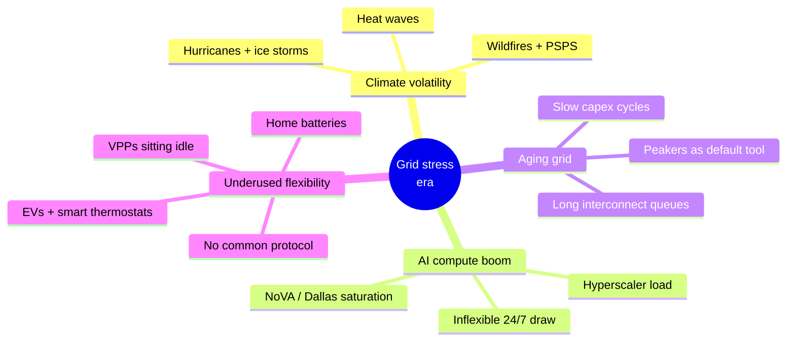
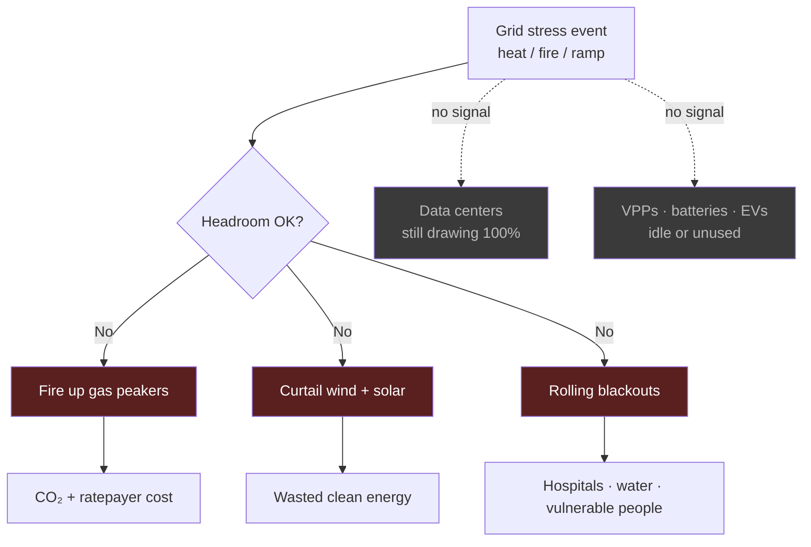
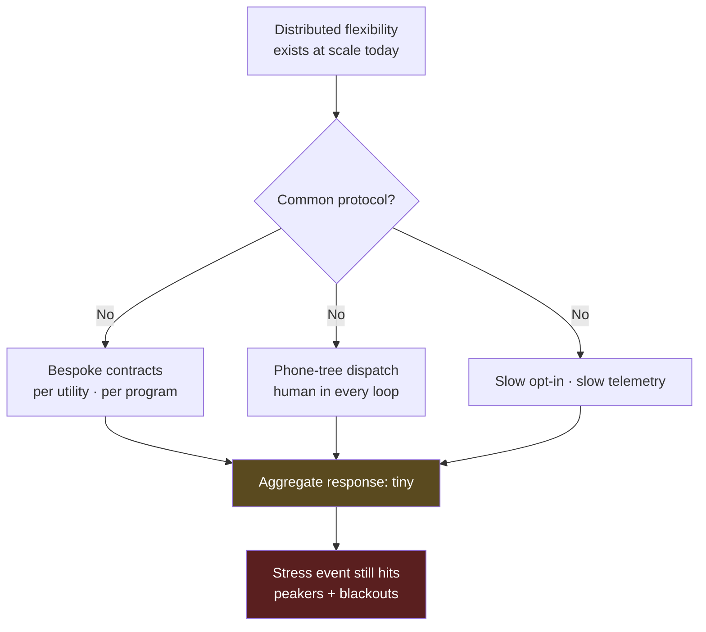
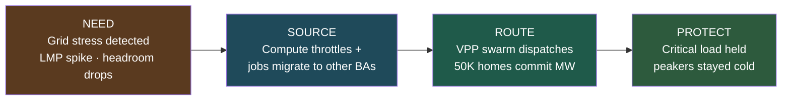
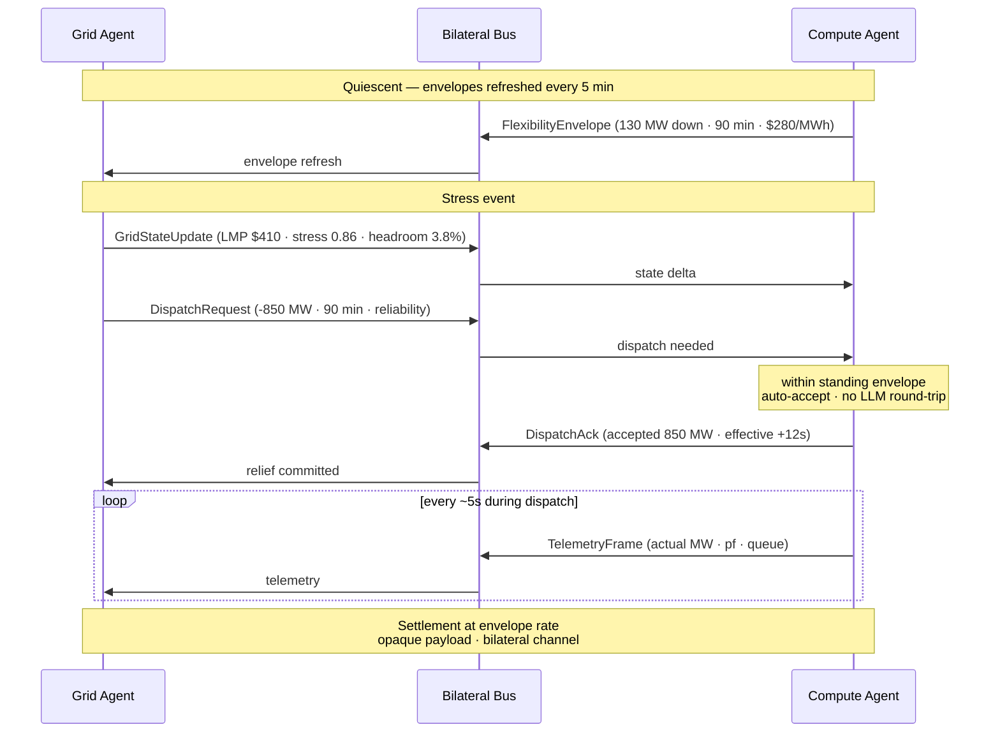
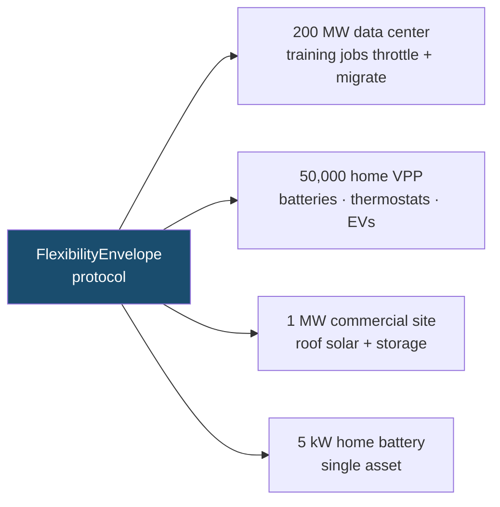
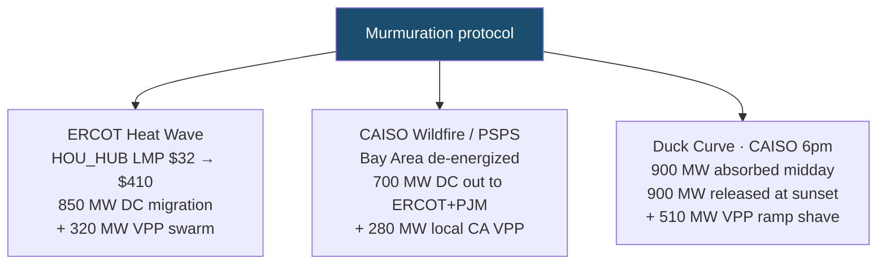
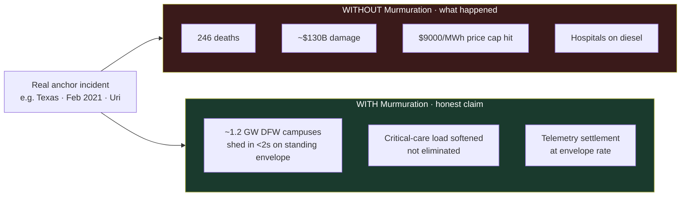
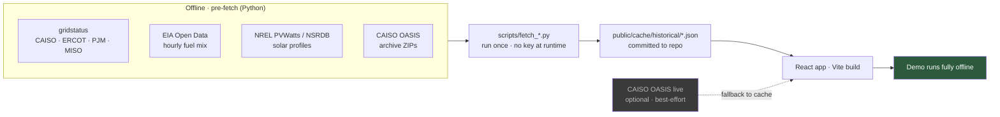

# Murmuration — Problem & Solution Diagrams

A visual companion to the parallel-work plan. Each diagram below frames a piece of the problem Murmuration is trying to solve, then the solution surface.

If a diagram below doesn't render, paste it into [mermaid.live](https://mermaid.live) — every block here is plain Mermaid.

---

## 1. The problem space — four converging pressures

The grid was not designed for the load shape, weather pattern, or asset mix it now faces. Four problems compound:

---

## 2. What happens today during a stress event

The default response is some mix of three bad outcomes — peakers, curtailment, blackouts — while flexible loads sit on the sidelines because no signal reaches them.

---

## 3. Why DERs alone haven't fixed it — the missing protocol

Distributed Energy Resources exist in the millions, but they aggregate to almost nothing in a real event because every dispatch path is bespoke.

---

## 4. Murmuration's intervention — the four-phase story

The demo plays a single arc — **need → source → route → protect** — across three different stress scenarios using the same protocol.

---

## 5. The bilateral protocol — how the two agents negotiate

Two agents (Grid-side ISO operator + Compute-side fleet ops) exchange typed messages on a shared bus. Standing **FlexibilityEnvelopes** mean dispatch is auto-accepted within band — no per-event human approval.

---

## 6. One protocol, every scale

The thesis: the **same** envelope schema fits a 200 MW data center and a 5 kW home battery without modification. Six orders of magnitude on a single wire.

---

## 7. The three demo scenarios

Three different physical events. Same protocol. Different asset mix per event.

---

## 8. Counterfactual framing — anchored to real incidents

Every "without Murmuration" claim must point to a real past event. The credibility win is being **conservative + precise** — "would have softened," not "would have prevented."

---

## 9. Offline-safe data architecture

Hard rule from §11.4 of the brainstorm: the demo must work with the network unplugged. All "real data" credibility comes from **historical replay**, pre-fetched offline into JSON snapshots committed to the repo.

---

## How these diagrams map to the parallel-work prompts

| Diagram | Prompts that build it |
|---|---|
| 1. Problem space | (framing only — no prompt) |
| 2. Today's failure mode | C2 (counterfactual) |
| 3. Missing protocol | (framing only) |
| 4. Four-phase story | already in `simulation.ts` (`story: need\|source\|route\|protect`) |
| 5. Bilateral protocol | `BusTicker.tsx` shows the wire JSON; **C1** adds the natural-language voices |
| 6. Every scale | already implicit in scenario data; reinforced by **C1** narration |
| 7. Three scenarios | already in `simulation.ts`; **A1** anchors them to real archived dates |
| 8. Counterfactual | **C2** + **D3** |
| 9. Data architecture | **A1** (gridstatus) · **A2** (EIA) · **A3** (cache layer) · **A5** (NREL) · **A1b** (live cherry) |
